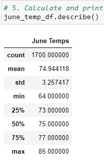
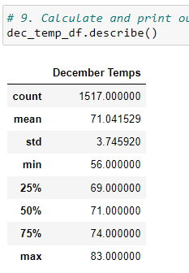

# surfs_up
 sql_lite, sql_alchemy, flask

### Module 9 Surfs_Up_Challenge
**File:** [SurfsUp_Challenge](/SurfsUp_Challenge.ipynb)

## Overview of Surfs Up Challenge:
The purpose of this challenge was to access the flat file "hawaii.sqlite", create an engine and reflect the database from the file into a new model, create a new session and save the tables into classes to be used in our analysis. After this preparation multiple session querys were run on the measurement table in our analysis including saving the queries for temperatures for the months of june and december into dataframes to be further analyzed.

## Results:
- From the statistics of the temperature from the month of June includes 1700 records, an average temperature of approximatley 74.94 degrees, minumum of 64 degrees and a maximum of 85 degrees

- From the statistics of the temperature from the month of December includes 1517 records, an average temperature of approximatley 71.04 degrees, minumum of 56 degrees and a maximum of 83 degrees

- When comparing the statistics of both months, the average temperature only had a difference of 3.9 degrees comparing june and december, the min for december is 8 degrees lower than june and the max of june is only 2 degrees higher than december.

## Summary:
From the analysis of both months, the diffrence between both months statistical temperatures is pretty low thus the weather in june would approximatley be very similar to december.
To gather more weather data for June and December a query to analyze the precipitation that occurs in both of these months can be created and another query to find the most active stations for further analysis.
